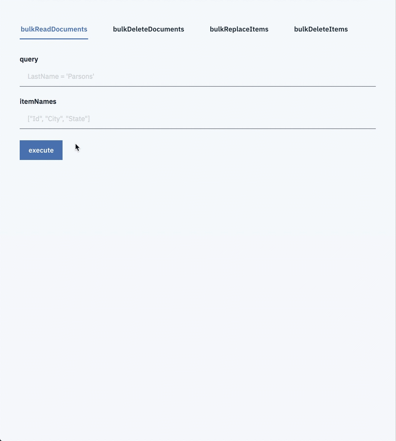

## Start node server
#### (Optoin 1). Run app from console
1. Copy the domino-db and domino-node-iam-client archives to the root directory

2. Copy [.env.sample](.env.sample) as `.env` and edit the environment variables in the 

3.  Build
```
npm install
npm run build
```

4.  Run
```
npm run start
```

#### (Optoin 2). Run app using Docker

1. Copy the domino-db domino-node-iam-client archives to the root directory

2. Copy [.env.sample](.env.sample) as `.env` and edit the environment variables in the 

3.  Build a Docker image
```
npm install
npm run build
docker build -f Dockerfile -t domino-appdev-playground:latest .
```

3.  Run
```
docker run -it -p 3000:3000 domino-appdev-playground:latest
```

#### (Option 3). Run app from Visual Studio Code
1. Open your local repository with Visual Studio Code
1. Copy the domino-db domino-node-iam-client archives to the root directory
1. Copy [.env.sample](.env.sample) as `.env` and edit the environment variables in the 
1. Select **Debug** -> **Start Debugging**

## Play with app
1. Open http://localhost:3000/playground
1. Input a query for reading documents (e.g. `Form = 'Contact' and LastName = 'Parsons'`)
1. Click **execute**

Then, matched documents will be listed in JSON format


